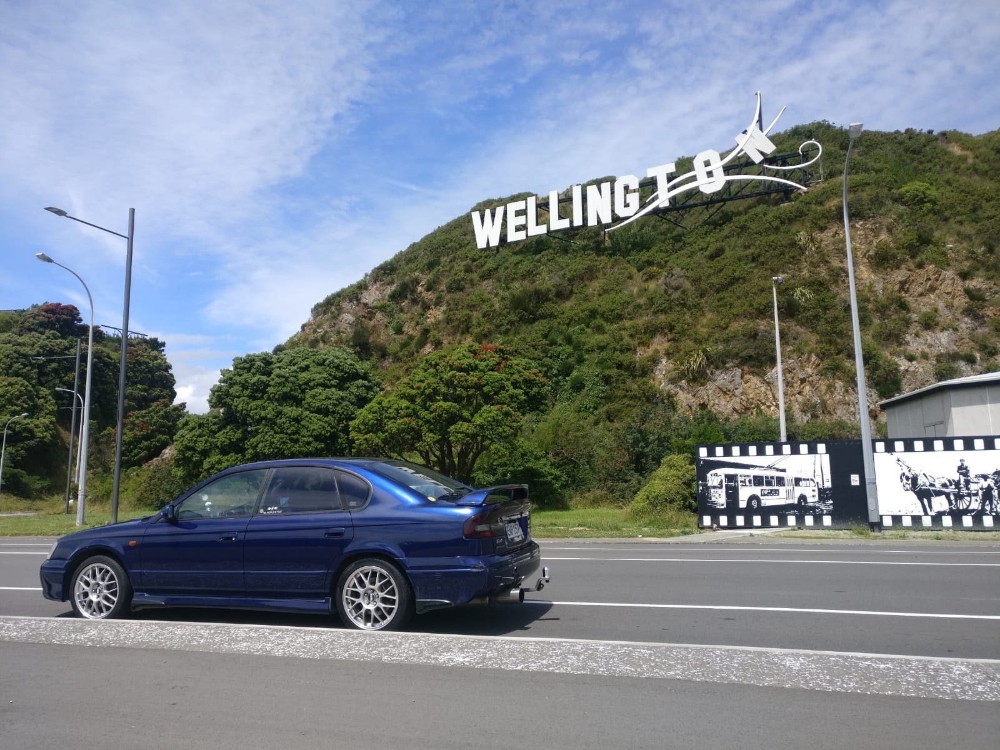
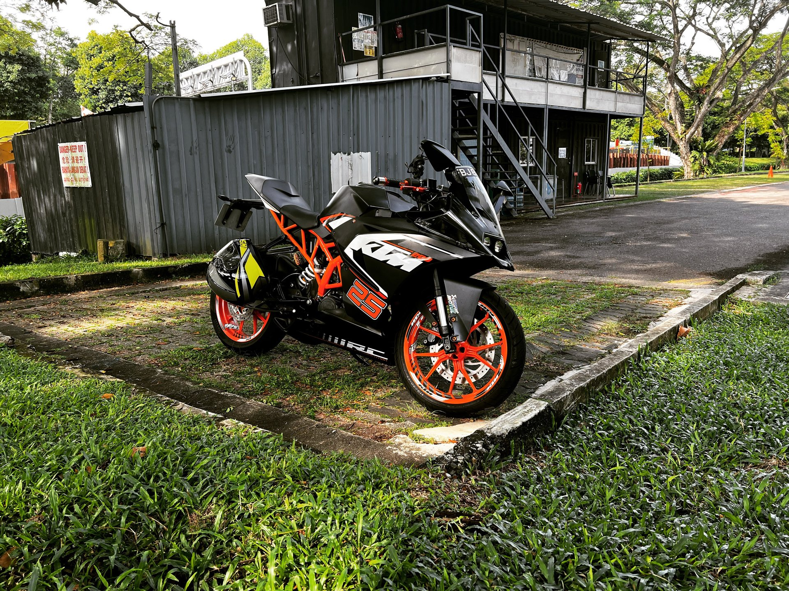
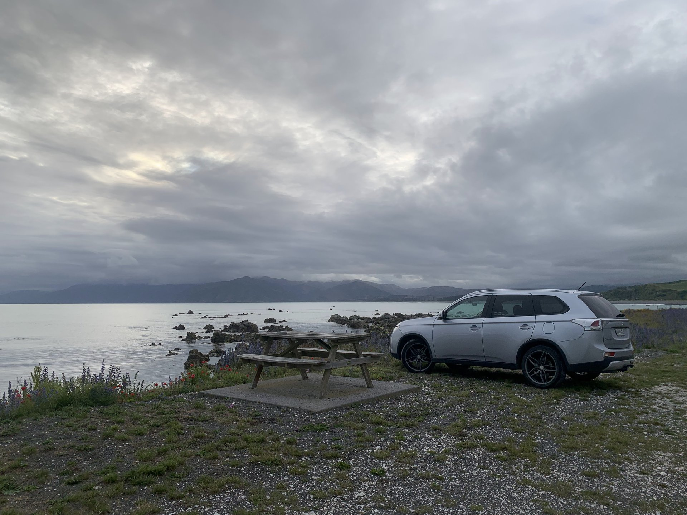
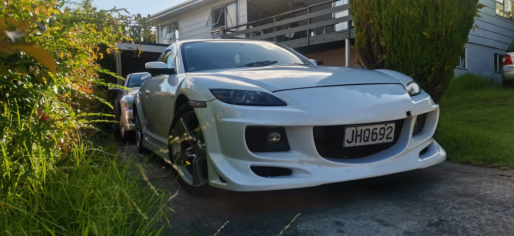
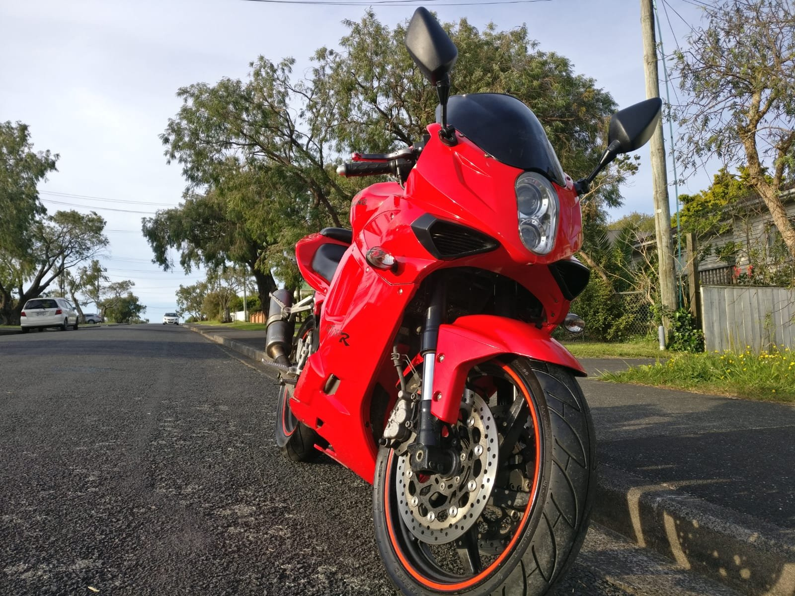

# 🚗 Vehicles — Garage Asset Registry

Web-optimized photos and a JSON manifest for **[The Garage](https://prasanthsasikumar.com/garage)** on
[prasanthsasikumar.com](https://prasanthsasikumar.com) — every car, motorcycle, and project I've owned or wrenched on,
one folder per vehicle.

This repo is the **content backend** for the garage page. It is served as a static asset host at
[`garrage.prasanthsasikumar.com`](https://garrage.prasanthsasikumar.com) (CORS-open via [`_headers`](_headers)), and the
Nuxt site reads [`assets.json`](assets.json) at build/runtime to render the gallery. Optimized JPEGs live here in Git;
high-resolution originals and videos stay on Google Drive so the repo stays fast to clone.

**At a glance:** 56 vehicles · 903 assets · 46 cars · 8 motorcycles · 2 garages

<table>
  <tr>
    <td width="33%"><br><sub><b>Mazda RX-8</b> · Westhaven, Auckland</sub></td>
    <td width="33%"><br><sub><b>Subaru Legacy B4</b> · Wellington</sub></td>
    <td width="33%"><br><sub><b>KTM RC 200</b></sub></td>
  </tr>
  <tr>
    <td width="33%"><br><sub><b>Mitsubishi Outlander</b> · Kaikōura coast</sub></td>
    <td width="33%"><br><sub><b>Mazda RX-8</b> (white)</sub></td>
    <td width="33%"><br><sub><b>Hyosung GT250R</b></sub></td>
  </tr>
</table>

## 📂 Structure

```
vehicles/
├── assets.json           # Manifest: every vehicle + asset, with local & remote paths
├── asset_manager.py      # Sync/optimize tooling
├── _headers              # CORS header for the static host
├── <Vehicle_Folder>/     # One per vehicle, e.g. Mazda_RX8_Purple/
│   └── *.jpg             # Web-optimized JPEGs (resized to max 1920px wide)
└── ...
```

`assets.json` (schema v2) groups vehicles into `cars`, `motorcycles`, and `garages`. Each vehicle carries a
`display_name`, `thumbnail_image`, `acquired_year`, an asset `summary`, and an `assets` block. Every asset records both
its `optimized_path` (in this repo) and `original_path` (the full-res source), plus a `location` of `local`, `remote`,
or `hybrid`.

## 🔁 Adding or updating photos

**Google Drive is the source of truth.** Add new media to the matching vehicle folder in the Drive backup, then let the
script optimize and index it.

```bash
# 1. Drop photos/videos into the vehicle folder in your Drive backup
# 2. Sync images: resize to 1920px, copy into the repo, rebuild assets.json
python asset_manager.py sync

# 3. (Optional) Copy/compress videos referenced by the manifest
python asset_manager.py video_sync

# 4. Commit and push
git add .
git commit -m "Sync assets from Drive"
git push
```

| Command | What it does |
|---|---|
| `sync` | Optimize images from the Drive backup into the repo and regenerate `assets.json`. |
| `video_sync` | Copy and compress videos from the Drive backup into the repo. |
| `migrate` | One-time initial move of assets into the Drive backup structure. |

## 🖼 Using assets in the site

Read paths from `assets.json` rather than hard-coding them:

- **Images** — use `optimized_path` for display (served from `garrage.prasanthsasikumar.com`), and `original_path` only
  for full-resolution download links.
- **Videos** — available remotely only; combine `original_path` with your Drive base URL.

## 🛠 Setup

Requires Python 3 and [Pillow](https://python-pillow.org/):

```bash
pip install Pillow
```

The Drive backup location is set by `DRIVE_PATH` at the top of `asset_manager.py`:

```python
DRIVE_PATH = '/Users/prasanthsasikumar/Downloads/vehicles_drive_backup'
```

Update it if your local Drive folder lives somewhere else. Videos are tracked with Git LFS (see `.gitattributes`).
